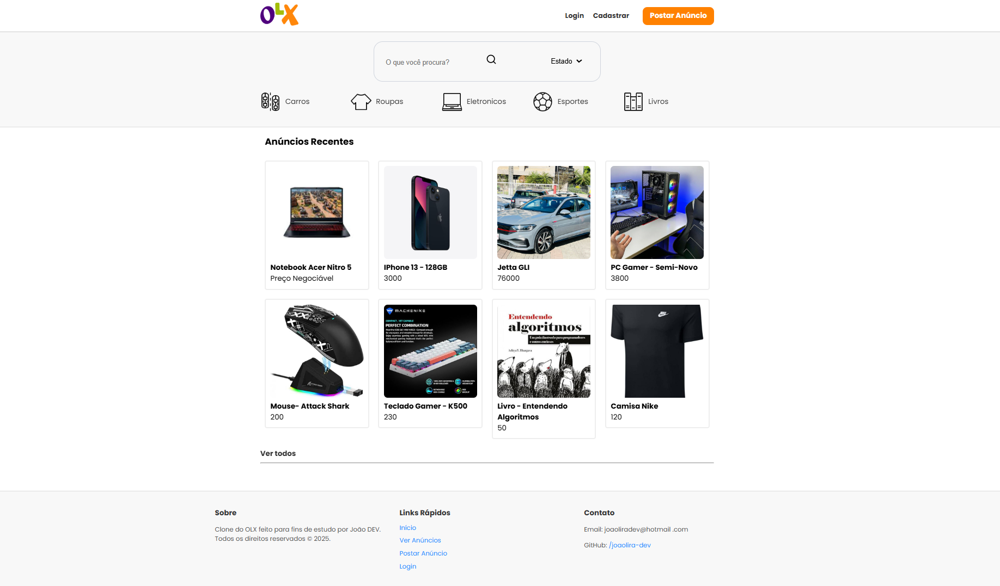
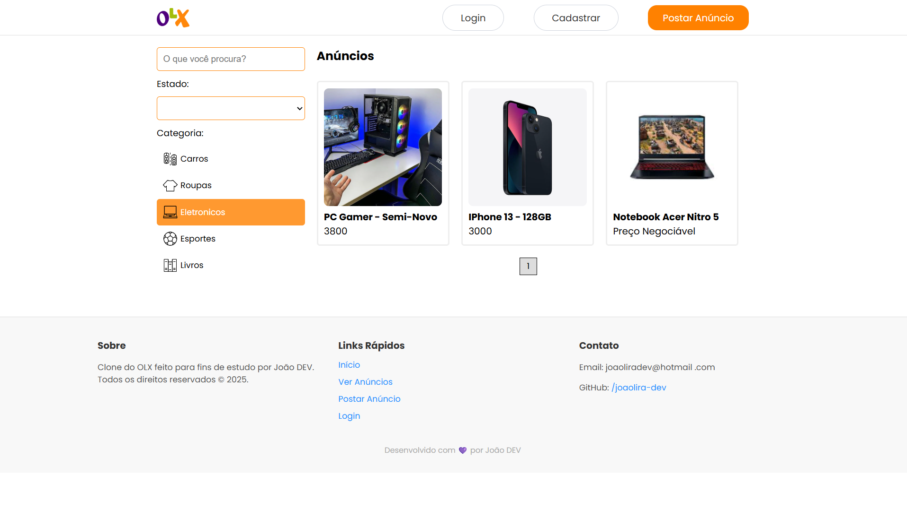

<h1 align="center">
  OLX Clone - Full Stack Project
</h1>

  🚀 Meu primeiro projeto full-stack, desenvolvido para estudo e prática!  
   
  🔗 <a href="https://olxclone-eta.vercel.app/" target="_blank">Acesse o Deploy</a>  

---

## 📚 Sobre o Projeto

Este projeto é um **clone simplificado da OLX**, criado para aplicar e consolidar conhecimentos em desenvolvimento web full-stack.

Durante a construção, enfrentei diversos desafios como:
- Integração entre Frontend e Backend
- Upload e tratamento de imagens
- Comunicação com MongoDB Atlas
- Organização de autenticação de usuários via JWT
- Deploy do projeto

Cada obstáculo superado foi uma oportunidade real de crescimento.

---

## ✨ Funcionalidades

- Cadastro de novos usuários
- Login e Logout
- Publicação de anúncios
- Upload de imagens nos anúncios
- Pesquisa de anúncios
- Página de detalhes do anúncio
- Página de detalhes da sua conta e seus anúncios

---

## 🛠️ Tecnologias Utilizadas

**Frontend:**
- React.js (Vite)
- CSS Modules
- React Router Dom
- Axios

**Backend:**
- Node.js
- Express.js
- MongoDB Atlas
- Mongoose
- JWT para autenticação
- Multer para upload de imagens

---

## Screenshots do Projeto

### Página Inicial

### Página de Anúncio

## 🚀 Link do Projeto Online

👉 **Deploy:** [olxclone-eta.vercel.app](https://olxclone-eta.vercel.app/)

---

